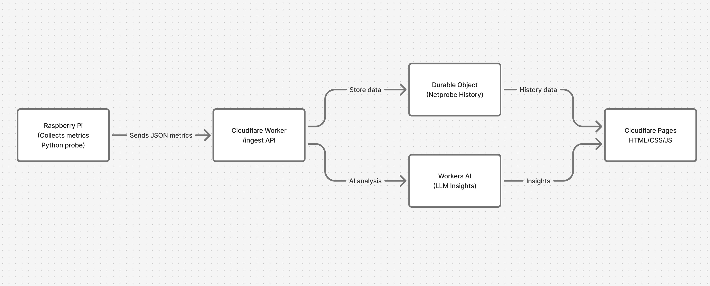

# PROMPTS

This file documents all AI-assisted interactions used during the development of NetProbe, including prompts, summaries of responses, and the commits influenced by them.

---

## Prompt - Creating Architecture Diagram (ChatGPT 5.1 - Figma Integration)

**Prompt:**

Create a Figma diagram of my project architecture based on the visual style in the image I attached. Include the following components:

A Raspberry Pi device (Client Probe)
- Runs a Python script that measures network health metrics (latency, jitter, packet loss, upload/download speeds)
- Periodically sends the collected metrics to a server endpoint

A Cloudflare Worker (Server Endpoint)
- Accepts incoming requests from the Raspberry Pi
- Processes the metrics and may forward them to additional analysis logic
- Uses Cloudflare Workers AI (LLM) to generate natural-language summaries or detect anomalies
- Exposes a lightweight HTTP API for retrieving the latest results

Analysis & Storage (two stacked components)
- Workers AI (LLM): generates insights
- Durable Object / Workflow storage: stores history

Frontend Web Page
- A simple static site (HTML/CSS/JS) that fetches data from the Worker
- Displays current network health, trends, and AI-generated summaries

**Result:**

